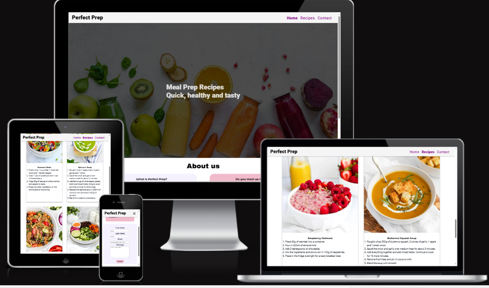
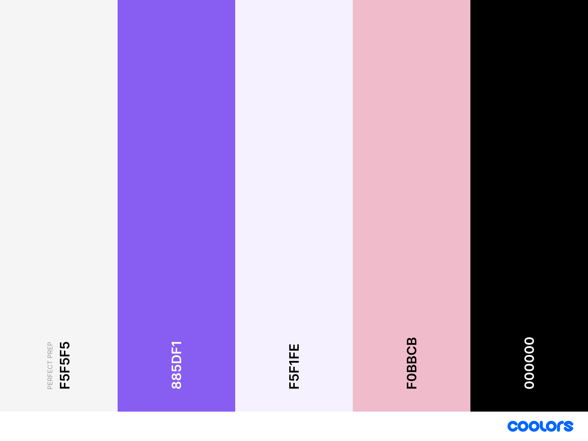

# Perfect Prep Website

'Perfect Prep' is designed to be a responsive website allowing visitors to view on a range of devices including mobile, tablet and desktop/laptop.

[View Perfect Prep on Github Pages](https://lauramasterton.github.io/perfect-prep/)

## Contents

* [User Experience](#user-experience-ux)
  * [User Stories](#user-stories)
   
    
* [Design](#design)
  * [Colour Scheme](#colour-scheme)
  * [Typography](#typography)
  * [Imagery](#imagery)
  * [Wireframes](#wireframes)

## User Experience (UX)
### User Stories
#### Client Goals
* To have a mobile-first responsive website.
* To view the website on a range of devices.
* To explain what Perfect Prep is.
* To connect users to Perfect Prep's social media accounts. 
* Allow visitors - members and potential members to view recipes.
* To allow users to contact Perfect Prep through a contact form for the purpose of asking questions or submitting recipe ideas. 
#### First Time Visitor Goals 
* I want to find out what perfect prep is.
* I want to navigate the website easily on my device. 
#### Returning Visitor Goals
* I want to find the latest recipes. 
* I want to be able to contact the website owner with questions that have not already been addressed. 
* I want to connect with Perfect Prep through social media.
* I want to  find their social media handles easily. 
#### Frequent Visitor Goals
* I want to view recipes I have viewed previously. 
* I want to submit my own recipes with ease.
* I want to contact the owner to provide my own ideas about Perfect Prep.
* I want to submit my own photographs to accompany a recipe. 
---
## Design
### Colour Scheme

The colours used are pastel colours. This is due in part to the minimalist approach and the colours are used in a way to bring attention to particular sections and not overwhelm the user with colour. The colours also bring a light hearted feeling to the website as there is a focus on community and friendship.
The website uses a colour palette created using the [Coolors](https://coolors.co/) website.
### Typography
[Google Fonts](https://fonts.google.com/) was used to embed the code for the font families selected.
[Fontjoy](https://fontjoy.com/) was the website used to select complimentary font families. 
[Roboto](https://fonts.google.com/specimen/Roboto) was used for the logo with the font weight of 800. It is a sans-serif font and is easy to read on all device sizes. It is simple and clear but it is not formal. This sets the tone for the website. As it is an online community with a focus around a specific topic.
[Montserrat-Alternates](https://fonts.google.com/specimen/Montserrat+Alternates) was used for the headings and subtitles. It is a sans serif font and considered a sister font to the 'normal' Montsterrat yet the 'Alternate' family has many unique letterforms. This means that the font is familiar but the unique style adds a sense of fun and creaativity.
[Archivo Black](https://fonts.google.com/specimen/Archivo+Black) is the font used in the body text of the website. 

### Wireframes
Wireframes were created for mobile and desktop. The project was designed with a mobile first approach and to have a fluid responsive website that could have similar design patterns for tablet and desktop without having to redesign for a large number of devices. The code was imagined to be as responsive as possible and so the smallest and largest wireframes were 'sketched'. If the project were to be expanded in the future and a more complex design was required I would account for this and create a wireframe for a tablet based device.
[Home Page Wireframe](docs/wireframes/home.PNG)
[Recipes Page Wireframe](docs/wireframes/recipes.PNG)
[Contact Page Wireframe](docs/wireframes/contact.PNG)
### Features
The website consists of three pages. 
1. Home.
2. Recipes.
3. Contact.

* All pages on the website have the following features:
* Responsive navigation bar;
On a mobile device the menu is a 'hamburger' menu which upon clicking shows a dropdown menu showing "Home", "Recipes" and "Contact".  This was implemented to give a minimalist look and to prevent overcrowding if the site owner decides to add more links in future.  The page the user selects will change to a font weight of 800 to indicate where they are on all screen sizes.
On larger screen sizes the three links are in the same order from light to right placed horizontally. This was to utilise the available space in the header as the logo is a text based only. However, if more links are to be added in future there is space and the code is available for the smaller screen to use a 'hamburger' menu if this becomes overcrowded in future.  
The user is alerted to the links they are hovering over by a change to the colour text on larger screen sizes.

* A footer which contains social media links for Facebook, 'X' (formerly twitter') and Instagram. Recognisable socia media icons were used in place of text as this is what users expect. 

1. **Home**
- The home page is split into two distinct sections. The first section is a hero image with a heading which directly states what the website is about - "Meal Prep Recipes" and a subsequent tagline "Quick, Healthy and Tasty". This ties in with the minimalist aesthetic of the website. The heading font sets the tone for additional headings and subheadings throughout the website for continuity. 
- The second section is an "about us" section with a grid like structure to address what users queries may be when first visiting the site.  There are currently 6 blocks that are arranged vertically on mobile screens and expand into two columns with 3 blocks each side on larger screens. 
2. **Recipes**
- The recipes page has a clear heading "Recipes" with a short introduction to what the page includes a selection of the site owners favourite meal prep recipes.
- The recipes show the image of the finished meal first, followed by teh name of the recipe and an ordered list of instructions.  Each image is the same size to create a sense of uniformity and on a mobile device the recipes are shown one under another in a single vertical column. On larger devices the responsive images become larger and two columns are created. Currently there is an odd number of recipes and the site is designed to place the remaining recipe in the centre underneath both columns for aesthic purposes. 
3. **Contact**
- A short list of reasons why a user my want to contact the site owner to encourage interaction. 
- There is a simple form with fields for the users: first name, last name, e-mail address and a text box for the user to write their message. Each field has labels for the field and accompanying placeholder text. Every field must be completed before a user can press submit, if any field is missed or not filled in the correct format a tooltip will alert the user to correct the error and highlight the field(s) to be ammended before pressing submit. When the form has been filled and submitted correctly a confirmation page with the values entered will be shown in a new window. (I chose to use the Code Institutes formdump link for the endpoint as opposed to creating a new page so users can see that their data has been submitted.  )

* **Future implementations**
 **Javascript**: 
 * The use of javascript to improve the hamburger menu.
 * Use Javascript to 'switch' between different vegan, vegetarian and meat-based options on the recipes.  
 * **Additional pages**
 - A community page where the site owner can request members to share their experience since using Perfect Prep and the ways it has made their life easier. 

 ### Accessibility 
 The website has approached accessibility by
 - Using semantic html
 - Using alt-attributes for images

 ### Languages
 HTML and CSS were the languages used throughout to create the website.
 ### Frameworks, Libaries and Programs 
- [Balsamiq](https://balsamiq.com/): used to create wireframes.
- Git: used for version control.
- [Github](https://github.com/): used to save and store the files necessary for the website.
- [Gitpod](https://gitpod.io/): used to write the code.
- [Fontjoy](https://fontjoy.com/): A font database generator to pair complimentary fonts. 
- [Google Fonts](https://fonts.google.com/): An open source library used to import the fonts desired for the website.
- [Favicon](https://favicon.io/): To create the favicon image in the browser tab.
- Google Dev Tools: used to debug, troubleshoot and test code. 
- [Tiny Png](https://tinypng.com/): Used to compress images for a faster loading time.
- [Am I Responsive?](https://ui.dev/amiresponsive): to show the website on a range of devices. 
- [Shields](https://shields.io): to add 'badges' for the README file.
 --- 
 ## Deployment and Local Development
 ### Deployment
 Github Pages was used to deploy the website. The steps to deploy this project are as follows:

 1. Log in (or sign up) to Github.
 2. Find the repository for this project, titled "Perfect-Prep".
 3. Click on 'settings' in the menu.
 4. Click on 'pages' in the navigation bar on the left.
 5. Under the section named 'source' select the 'main' branch from the dropdown menu and 'root' as the folder in the dropdown menu. 
 6. Click save. The github page is now live and deployed with the URL provided on screen.

### Local Development
#### How to Fork

To fork the "Perfect-Prep" repository:

1. Log in (or sign up) to Github.
2. Go to the repository [lauramasterton/perfect-prep](https://github.com/LauraMasterton/perfect-prep).
3. Click the fork button located in the top right corner. 

#### How to Clone

To clone the "Perfect-Prep" repository, follow these steps:

1. Log in (or sign up) to GitHub.
2. Go to the repository [lauramasterton/perfect-prep](https://github.com/LauraMasterton/perfect-prep)
3. Click on the code button and select if you would like to clone the repository with HTTPS, SSH or GitHub CLI and then copy the link provided. 
4. Open the terminal in your code editor. Change the working directory to the desired location for the cloned directory. 
5. In the terminal type 'git clone' and paste the link you copied in step 3 and press enter. 
---
## Testing
Testing was a continuous process using the html validator tool consistently and not just at the end of the project. I also used chrome developer tools to identify issues and test and edit code within the dev tools environment. 

Issues that were discussed with my mentor were problems regarding responsiveness. I had difficulty in creating a seamless transition between devices with my hero image. I was encouraged to look at the sizing rules. It became clear that giving a standard width of 100% was not suitable for my image. I introduced a new parameter of a max-width which ensured that the image would resize accordingly and this issue has now been resolved.

My contact form did not submit the data initially and this was something I had not tested at that time because the form was displaying correctly. My mentor encouraged me to look at all of the elements required for a functioning form. After returning to the course materials I included everything necessary and now a user can enter data and press submit. I initially was going to create my own 'thank you' page, however, my mentor informed me that this would not show that the data has submitted and so I was referred to the code institutes form submission which I have now implemented. 

I had difficulty in creating the recipe cards but after inspection using dev tools the image sizes were not equal meaning that my code would not work. I resized the images and uploaded them again and this worked successfully. 

As I progressed through the project my initial colour palette did not provide a user friendly experience and distracted from the content and I used temporary colours as I worked on the code. I generated another colour palette to fit in with the vision of the project and whilst it provided an aesthetically pleasing user experience, when it came to testing the contrasts were not strong enough and it was not suffficient for accessibility.This lead me to generating another colour palette to ensure it passed accessibility checks. This method was ineffective and it is something I will check from the start if any additional colours were to be added to this project in future. 

My code was also not at 100% for accessibility because I did not automatically place alt attributes for my images. This will be done at the same time as I write code for images in future expansions of this project.

-[Known Bugs](#known-bugs)
The form on the contact page has a messsage box that the user can resize. I submitted my code for peer review and the suggestions to rectify this did not work. I could not find an answer to thisparticular issue online.  

### W3C Validator

The W3C Validator was used to [validate the HTML](https://validator.w3.org/) and this tool was also used to [validate the CSS](https://jigsaw.w3.org/css-validator/).

* [Index page HTML](docs/testing/w3c/indexvalidator.JPG)
* [Recipes page HTML](docs/testing/w3c/recipesvalidator.png)
* [Contact page HTML](docs/testing/w3c/contactvalidator.png)
* [style.css CSS](docs/testing/w3c)

---
## Credits
* I used and modified the Code Institutes code for the hamburger menu in the course contents walkthrough project.
* I used [Get CSS](https://getcssscan.com/css-box-shadow-examples) example #21 for the box shadow code on the recipe cards.
#### Content
Content of the website was written by Laura Masterton. The recipes were inspired from [Planted in the Kitchen](https://plantedinthekitchen.com/)
### Media
#### 
* Hero Image: the image was taken from [Superfood and Berries](https://superfoodandberries.com/pages/72-timmars-detoxkur/)
* Recipe images: all images were taken from [Planted in the Kitchen](https://plantedinthekitchen.com/)
- [Broccoli Salad](https://plantedinthekitchen.com/broccoli-crunch-salad/)
- [Burrito Bowl](https://plantedinthekitchen.com/plant-based-taco-bowls/)
- [Butternut Squash Soup](https://plantedinthekitchen.com/butternut-squash-apple-soup/)
- [Mango Breakfast Smoothie](https://plantedinthekitchen.com/mango-smoothie/)
- [Pasta Marinara Sauce](https://plantedinthekitchen.com/san-marzano-tomato-sauce/)
- [Raspberry Overnight Oats](https://plantedinthekitchen.com/raspberry-oatmeal/)
- [Spinach Soup](https://plantedinthekitchen.com/spinach-white-bean-soup/)
- [Veggie Summer Rolls](https://plantedinthekitchen.com/summer-rolls/)

### Acknowledgements
I would like to thank:
* My mentor [Rory Sheridan](https://github.com/Ri-Dearg) for his invaluable guidance.
* The Code Institute student support team. 